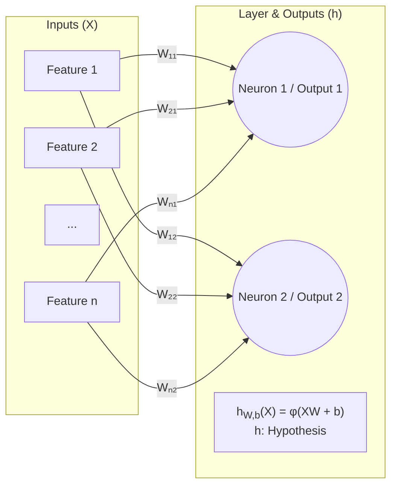
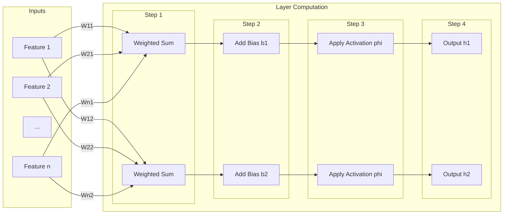

### Equation: `h_W,b(X) = φ(XW + b)`

* **`h` (Hypothesis Function)**
    * Represents the overall function of the entire layer. It takes inputs `X` and uses parameters `W` and `b` to make a prediction or "hypothesis."

* **`h_W,b(X)` (The Final Output)**
    * The result of the entire calculation for a batch of inputs `X`. It is a matrix where each row is the output vector for the corresponding input instance.

* **`X` (Input Matrix)**
    * A matrix containing your dataset. Each row is a single instance or example, and each column is a feature of that instance. Its shape is (number of instances, number of features).

* **`W` (Weight Matrix)**
    * A matrix containing the "learnable" connection strengths. Each element `W_ij` represents the weight of the connection from the *i-th* input feature to the *j-th* neuron. This is how the layer learns.

* **`b` (Bias Vector)**
    * A vector containing an additional learnable parameter for each neuron. The bias allows a neuron to have a baseline activation, making the model more flexible.

* **`XW` (Weighted Sum)**
    * The matrix multiplication of the inputs `X` and weights `W`. This operation calculates the combined influence of all input features on each neuron for every instance.

* **`XW + b` (Pre-Activation / Logits)**
    * The result of the full linear operation. It's the "raw score" calculated for each neuron before the final activation step. This value is often denoted as `Z`.

* **`φ` (Phi - The Activation Function)**
    * A non-linear function (like ReLU, Sigmoid, etc.) that is applied element-wise to the pre-activation scores (`XW + b`). Its purpose is to introduce non-linearity, allowing the network to learn complex patterns. It determines the neuron's final output based on its raw score.

### The Computational Flow

This diagram shows the process. The tables below will show the data at each numbered step.



-----

### The Data at Each Step

Here are the tables that correspond to the diagram above.

#### Initial Inputs

These are the matrices we start with.

  * **Input Data `X`** *(Shape: 4x3)*
    | | Feature 1 | Feature 2 | Feature 3 |
    | :--- | :--- | :--- | :--- |
    | **User 1** | 25 | 5.5 | 3 |
    | **User 2** | 45 | 1.2 | 10 |
    | **User 3** | 31 | 8.9 | 1 |
    | **User 4** | 19 | 2.1 | 2 |

  * **Weight Matrix `W`** *(Shape: 3x2)*
    | | N1 Weight | N2 Weight |
    | :--- | :--- | :--- |
    | **From F1** | `0.1` | `-0.5` |
    | **From F2**| `0.6` | `0.2` |
    | **From F3** | `-0.2` | `0.9`|

  * **Bias Vector `b`** *(Shape: 1x2)*
    | | N1 Bias | N2 Bias |
    | :--- | :--- | :--- |
    | **Bias** | `0.5` | `1.1` |

-----

#### Result of Step 1: Weighted Sum (`XW`)

This is the result of multiplying the input features by the weights for each neuron.
*(Shape: 4x2)*
| | Neuron 1 Score | Neuron 2 Score |
| :--- | :--- | :--- |
| **User 1** | `5.2` | `-8.7` |
| **User 2** | `3.22` | `-13.26`|
| **User 3** | `8.24` | `-12.82`|
| **User 4** | `2.76` | `-7.28` |

#### Result of Step 2: Add Bias (`XW + b`)

This is the final score for each neuron before activation, often called `Z`.
*(Shape: 4x2)*
| | N1 Score + Bias | N2 Score + Bias |
| :--- | :--- | :--- |
| **User 1** | `5.7` | `-7.6` |
| **User 2** | `3.72` | `-12.16`|
| **User 3** | `8.74` | `-11.72`|
| **User 4** | `3.26` | `-6.18` |

#### Result of Step 3 & 4: Apply Activation & Final Output (`h = φ(Z)`)

We apply the **ReLU** activation (`max(0, z)`) to get the final output `h`.
*(Shape: 4x2)*
| | Final Output h1 | Final Output h2 |
| :--- | :--- | :--- |
| **User 1** | `5.7` | `0` |
| **User 2** | `3.72` | `0` |
| **User 3** | `8.74` | `0` |
| **User 4** | `3.26` | `0` |

```python
import numpy as np

# ======================================================================
# 1. DEFINE THE INPUT MATRICES AND VECTORS
# ======================================================================

# Input Data Matrix X
# Shape: (4 instances, 3 features)
X = np.array([
    [25, 5.5, 3],
    [45, 1.2, 10],
    [31, 8.9, 1],
    [19, 2.1, 2]
])

# Weight Matrix W
# Shape: (3 features, 2 neurons)
W = np.array([
    [0.1, -0.5],
    [0.6, 0.2],
    [-0.2, 0.9]
])

# Bias Vector b
# Shape: (1 row, 2 neurons)
b = np.array([0.5, 1.1])


# ======================================================================
# 2. PERFORM THE LAYER COMPUTATION: h = φ(XW + b)
# ======================================================================

# First, calculate the linear part: Z = XW + b
# This combines the weighted sum (XW) and the bias addition (+b).
# np.dot() performs the matrix multiplication.
Z = np.dot(X, W) + b

# Next, apply the activation function φ.
# We will use the ReLU (Rectified Linear Unit) function: φ(z) = max(0, z)
h = np.maximum(0, Z)


# ======================================================================
# 3. PRINT THE RESULTS
# ======================================================================

print("--- INPUTS ---")
print("Input Matrix X (shape {}):".format(X.shape))
print(X)
print("\nWeight Matrix W (shape {}):".format(W.shape))
print(W)
print("\nBias Vector b (shape {}):".format(b.shape))
print(b)
print("\n" + "="*50 + "\n")

print("--- CALCULATED OUTPUTS ---")

print("Pre-Activation Scores Z = XW + b (shape {}):".format(Z.shape))
print(Z)

print("\nFinal Output h = ReLU(Z) (shape {}):".format(h.shape))
print(h)
```

Outputs:

```console
--- INPUTS ---
Input Matrix X (shape (4, 3)):
[[25.   5.5  3. ]
 [45.   1.2 10. ]
 [31.   8.9  1. ]
 [19.   2.1  2. ]]

Weight Matrix W (shape (3, 2)):
[[ 0.1 -0.5]
 [ 0.6  0.2]
 [-0.2  0.9]]

Bias Vector b (shape (2,)):
[0.5 1.1]

==================================================

--- CALCULATED OUTPUTS ---
Pre-Activation Scores Z = XW + b (shape (4, 2)):
[[  5.7   -7.6 ]
 [  3.72 -12.16]
 [  8.74 -11.72]
 [  3.26  -6.18]]

Final Output h = ReLU(Z) (shape (4, 2)):
[[5.7  0.  ]
 [3.72 0.  ]
 [8.74 0.  ]
 [3.26 0.  ]]
```

---

### From a Single Layer to a Deep Network

The diagram above shows the full computation for a *single* layer. Deep neural networks are built by stacking these layers one after another, which allows them to learn increasingly complex patterns from data.

**Key Concept: Connecting Layers and Forward Propagation**

This process, known as **forward propagation**, is sequential. The network calculates the full output of the first layer, then uses that result to calculate the full output of the second layer, and so on. **Each layer is calculated separately and in turn, from the input layer through to the final output layer.**

Crucially, this means:

> The outputs of one layer (`h`) become the new inputs (`X`) for the very next layer.

This chaining process allows the network to learn increasingly complex features. The first layer might learn simple patterns (like edges in an image), the next layer combines those to learn more complex features (like eyes and noses), and a final layer might combine those to identify a complete object (like a face).

**The Special Role of the Final Layer**

While the hidden layers in a network are generally the same (often using the ReLU activation function), the **final layer** is special because it's designed to produce the answer in the correct format for the problem you are solving. Its configuration depends on the task:

* **For Regression (predicting a value, like a house price):**
    * **Number of Neurons:** 1
    * **Activation Function:** None (or "Linear"). The raw score (`Z`) is the output, as the prediction can be any number, positive or negative.

* **For Binary Classification (predicting one of two classes, like "cat" or "dog"):**
    * **Number of Neurons:** 1
    * **Activation Function:** **Sigmoid**. This squashes the output to a value between 0 and 1, which represents a probability (e.g., an output of 0.92 means a 92% probability of it being a "cat").

* **For Multiclass Classification (predicting one of many classes, like "cat," "dog," or "bird"):**
    * **Number of Neurons:** `N`, where `N` is the number of classes.
    * **Activation Function:** **Softmax**. This function takes the scores from all `N` neurons and converts them into a probability distribution, where all the outputs sum to 1 (e.g., `[0.85, 0.10, 0.05]`, meaning 85% probability of "cat", 10% of "dog", and 5% of "bird").
