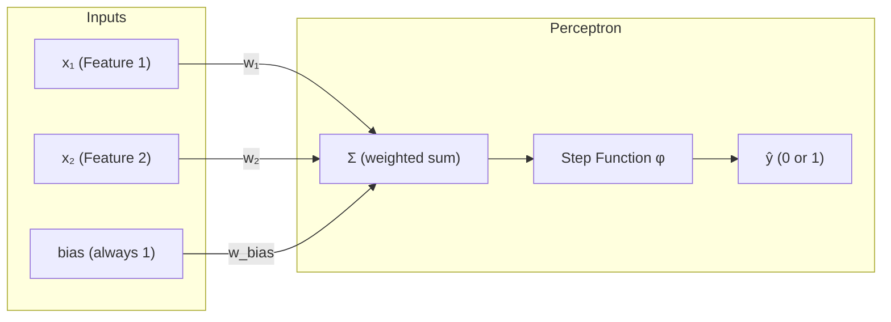
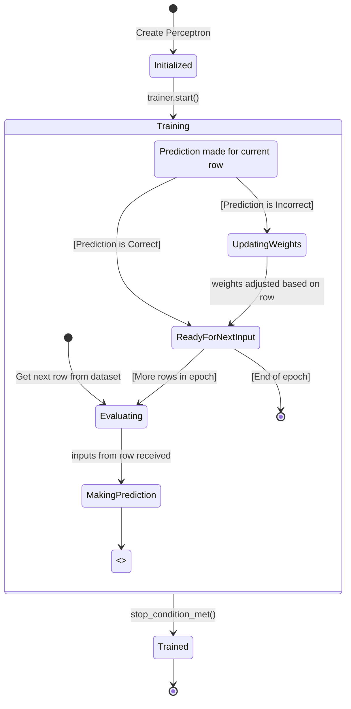

### The Perceptron Learning Rule: A Step-by-Step Guide

If you've ever wondered how a machine can "learn" from data, the Perceptron learning rule is one of the simplest and most foundational examples. It provides an intuitive method for training a single-layer neural network (a Perceptron) for binary classification tasks. This guide will walk you through the process, from the core theory to a concrete, practical example.

The main idea is to iteratively adjust the network's connection weights based on the errors it makes, thereby "learning" from its mistakes to improve its predictions.

#### The Goal: Minimizing Error

Imagine a Perceptron with multiple inputs and a single output neuron. Its task is to classify an input pattern as belonging to one of two classes (e.g., "Spam" or "Not Spam"). The Perceptron makes a prediction by calculating a weighted sum of its inputs and then applying an activation function. A common choice for this is the **step function**, which typically outputs 1 if the calculated sum is positive and 0 otherwise.

The Perceptron learns by being shown examples from a training set, one at a time. For each example, it makes a prediction which is then compared to the actual, correct label (the target output). If the prediction is wrong, the learning rule is applied to adjust the weights.

The key principle is **error-driven learning**: the connection weights are only modified when the network makes a mistake. If the prediction is correct, the weights are left unchanged.

#### The Learning Rule Equation

Here is an example Perceptron:



The mechanism for updating the weights is captured in this simple and elegant equation:

$w^{\text{new}} = w^{\text{old}} + \eta \cdot (\text{target output} - \text{predicted output}) \cdot \text{input}$

Or, using more formal notation:

$w_{i,j}^{(\text{next step})} = w_{i,j} + \eta \cdot (y_j - \hat{y}_j) \cdot x_i$

Let's break down each component:

* **$w_{i,j}$**: This is the **connection weight** between the i-th input and the j-th neuron. Think of it as the importance of that input in the neuron's decision. A large positive weight is excitatory, while a large negative weight is inhibitory.
* **$x_i$**: This is the value of the **i-th input** for the current training instance.
* **$\hat{y}_j$** (y-hat): This is the **predicted output** of the j-th neuron for the current instance (e.g., 0 or 1).
* **$y_j$**: This is the **target output** (the correct label) for the j-th neuron.
* **$\eta$** (eta): This is the **learning rate**, a small positive number (e.g., 0.1). It controls how large of a step we take when adjusting the weights.
* **Bias**: In practice, a special input called a *bias* is often added. This input always has a value of 1 and has its own weight that is updated just like the others. The bias allows the Perceptron to shift its decision boundary, making it more flexible. Think of it as the y-intercept in the line equation $y = mx + b$.
* **$(y_j - \hat{y}_j)$**: This is the **error term**. It's the most critical part, as it dictates the update:
    1.  **Error = 0**: The prediction was correct ($y_j = \hat{y}_j$). The whole update term becomes zero, and no weights are changed.
    2.  **Error = 1**: The neuron should have fired but didn't (predicted 0, target was 1). The update will be positive, strengthening the connections that should have led to a positive result.
    3.  **Error = -1**: The neuron fired when it shouldn't have (predicted 1, target was 0). The update will be negative, weakening the connections that led to the incorrect firing.




---

### Example: A Simple Perceptron for Binary Classification

Let's walk through a single learning step. Our Perceptron will try to classify an input as belonging to either the positive class (output = 1) or negative class (output = 0).

#### Step 1: Initial State

* **Inputs for one training instance ($\mathbf{x}$):**
    * $x_1 = 1$ (Feature 1 is present/active)
    * $x_2 = 0$ (Feature 2 is absent/inactive)
    * $x_{\text{bias}} = 1$ (This input is always 1)
* **Initial Weights ($\mathbf{w}$):**
    * $w_1$ (for $x_1$) = 0.2
    * $w_2$ (for $x_2$) = 0.6
    * $w_{\text{bias}} = -0.5$
* **Learning Rate ($\eta$):**
    * $\eta = 0.1$
* **Correct Output for this instance ($y$):**
    * $y = 1$ (This instance belongs to the positive class)

#### Step 2: Make a Prediction ($\hat{y}$)

First, calculate the weighted sum of the inputs.

$\text{Sum} = (w_1 \cdot x_1) + (w_2 \cdot x_2) + (w_{\text{bias}} \cdot x_{\text{bias}})$

$\text{Sum} = (0.2 \cdot 1) + (0.6 \cdot 0) + (-0.5 \cdot 1)$

$\text{Sum} = 0.2 + 0 - 0.5 = -0.3$

Now, apply the step function. Since $\text{Sum}$ (-0.3) is not greater than 0, the prediction is 0.

* **Predicted Output ($\hat{y}$) = 0** (The model predicts negative class)

#### Step 3: Calculate the Error

Compare the correct output ($y$) with the predicted output ($\hat{y}$).

$\text{Error} = y - \hat{y} = 1 - 0 = 1$

An error of $+1$ means the neuron should have fired but didn't. We must update the weights to correct for this.

#### Step 4: Apply the Learning Rule to Update Weights

The update rule is: $w^{\text{new}} = w^{\text{old}} + (\eta \cdot \text{Error} \cdot x)$

**1. Update $w_1$:**

$w_1^{\text{new}} = w_1 + (\eta \cdot \text{Error} \cdot x_1)$

$w_1^{\text{new}} = 0.2 + (0.1 \cdot 1 \cdot 1) = 0.2 + 0.1 = 0.3$

*Reasoning:* Since $x_1$ was active (1) and the error was positive, we increase $w_1$. This strengthens the connection, making Feature 1 a stronger indicator of the positive class.

**2. Update $w_2$:**

$w_2^{\text{new}} = w_2 + (\eta \cdot \text{Error} \cdot x_2)$

$w_2^{\text{new}} = 0.6 + (0.1 \cdot 1 \cdot 0) = 0.6 + 0 = 0.6$

*Reasoning:* Since $x_2$ was inactive (0), it didn't contribute to the error. Its weight remains unchanged.

**3. Update $w_{\text{bias}}$:**

$w_{\text{bias}}^{\text{new}} = w_{\text{bias}} + (\eta \cdot \text{Error} \cdot x_{\text{bias}})$

$w_{\text{bias}}^{\text{new}} = -0.5 + (0.1 \cdot 1 \cdot 1) = -0.5 + 0.1 = -0.4$

*Reasoning:* The bias input is always active, so its weight is increased to make the neuron generally more likely to fire, pushing the sum closer to the positive side.

#### Summary of the Learning Step

After this single step, the Perceptron's weights have been nudged in the right direction:

* $w_1$: from 0.2 to **0.3**
* $w_2$: from 0.6 to **0.6** (no change)
* $w_{\text{bias}}$: from -0.5 to **-0.4**

If we were to re-calculate the sum with the new weights, it would be:

$\text{Sum} = (0.3 \cdot 1) + (0.6 \cdot 0) + (-0.4 \cdot 1) = 0.3 + 0 - 0.4 = -0.1$

The output is still 0, but the sum moved from -0.3 to -0.1, showing that this step has pushed the model closer to the correct prediction.

---

### Code: A Simple Perceptron for Binary Classification

```python
class Perceptron:
    def __init__(self, learning_rate=0.1):
        self.learning_rate = learning_rate
        self.weights = None
        
    def step_function(self, weighted_sum):
        return 1 if weighted_sum > 0 else 0
    
    def predict(self, inputs):
        inputs_with_bias = inputs + [1]
        weighted_sum = sum(w * x for w, x in zip(self.weights, inputs_with_bias))
        prediction = self.step_function(weighted_sum)
        return prediction, weighted_sum
    
    def update_weights(self, inputs, target, prediction):
        inputs_with_bias = inputs + [1]
        error = target - prediction
        
        for i in range(len(self.weights)):
            old_weight = self.weights[i]
            self.weights[i] = old_weight + self.learning_rate * error * inputs_with_bias[i]
            
            input_name = f"x_{i+1}" if i < len(inputs) else "bias"
            print(f"  {input_name}: {old_weight:.1f} + ({self.learning_rate} × {error} × {inputs_with_bias[i]}) = {self.weights[i]:.1f}")

def main():
    print("=== Perceptron Learning Rule Example ===\n")
    
    # Initialize and set weights from document example
    perceptron = Perceptron(learning_rate=0.1)
    perceptron.weights = [0.2, 0.6, -0.5]  # [w1, w2, w_bias]
    
    print("Initial weights: w1=0.2, w2=0.6, w_bias=-0.5")
    print("Learning rate (η): 0.1\n")
    
    # Training instance: x1=1, x2=0, target=1
    inputs = [1, 0]
    target = 1
    
    print("Training instance: x1=1, x2=0, bias=1, target=1\n")
    
    # Make prediction
    prediction, weighted_sum = perceptron.predict(inputs)
    print(f"Weighted sum: (0.2×1) + (0.6×0) + (-0.5×1) = {weighted_sum}")
    print(f"Prediction: {prediction} (step function)\n")
    
    # Calculate and show error
    error = target - prediction
    print(f"Error: {target} - {prediction} = {error}\n")
    
    # Update weights
    print("Weight updates (w_new = w_old + η × error × input):")
    perceptron.update_weights(inputs, target, prediction)
    
    # Show final result
    print(f"\nFinal weights: w1={perceptron.weights[0]:.1f}, w2={perceptron.weights[1]:.1f}, w_bias={perceptron.weights[2]:.1f}")
    
    # Verify improvement
    _, new_sum = perceptron.predict(inputs)
    print(f"New weighted sum: {new_sum:.1f} (improved from -0.3 to -0.1)")

if __name__ == "__main__":
    main()
```
which outputs:

```console
=== Perceptron Learning Rule Example ===

Initial weights: w1=0.2, w2=0.6, w_bias=-0.5
Learning rate (η): 0.1

Training instance: x1=1, x2=0, bias=1, target=1

Weighted sum: (0.2×1) + (0.6×0) + (-0.5×1) = -0.3
Prediction: 0 (step function)

Error: 1 - 0 = 1

Weight updates (w_new = w_old + η × error × input):
  x_1: 0.2 + (0.1 × 1 × 1) = 0.3
  x_2: 0.6 + (0.1 × 1 × 0) = 0.6
  bias: -0.5 + (0.1 × 1 × 1) = -0.4

Final weights: w1=0.3, w2=0.6, w_bias=-0.4
New weighted sum: -0.1 (improved from -0.3 to -0.1)
```

---

### What's Next? The Big Picture

This process of predicting, calculating error, and updating weights is performed for a single training instance. In a real-world scenario, a Perceptron algorithm would:

1.  **Iterate** through every example in the training dataset, updating the weights whenever a mistake is made.
2.  **Repeat** this process over the entire dataset multiple times. Each full pass through the dataset is called an ***epoch***.
3.  **Continue** for a set number of epochs or until the model can correctly classify all training examples.

This simple rule is guaranteed to find a solution, but only if the data is **linearly separable**—meaning it can be perfectly divided by a straight line or plane. This limitation is what eventually led to the development of more complex, multi-layered neural networks.
